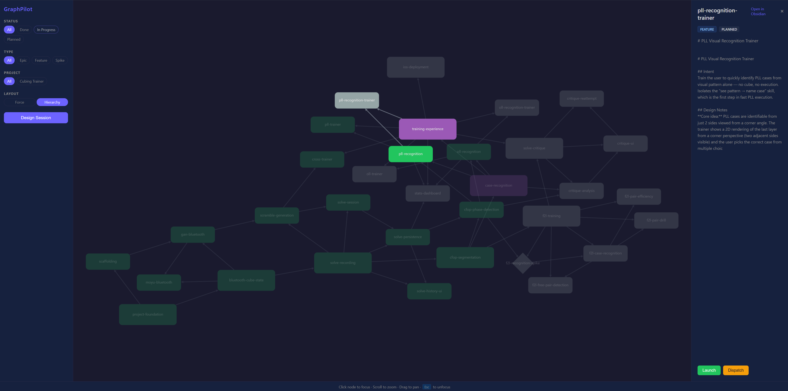

# GraphPilot

A CLI that turns an Obsidian vault into a visual project planning surface, tightly integrated with Claude Code for implementation. Plan work as a dependency graph, launch scoped AI sessions with full context, and track progress — all from markdown files in your vault.



## How It Works

GraphPilot nodes are regular Obsidian markdown files with `gp: true` in their frontmatter. They link to each other with wikilinks, forming a dependency graph that drives execution order. The CLI reads this graph to assemble context for Claude Code sessions and keeps status in sync as work completes.

**Design -> Plan -> Execute -> Complete** — each step stays in your vault where you can see it in Obsidian's graph view, query it with Dataview, or visualize it on a Canvas.

## Node Types

| Type | Purpose |
|------|---------|
| **Epic** | Large body of work with multiple features |
| **Feature** | Deliverable capability (child of epic) |
| **Task** | Concrete implementation unit — the primary dispatch target |
| **Spike** | Time-boxed research |
| **Dispatch-task** | Auto-created child for parallel execution via Dispatch |

Nodes progress through statuses: `planned` -> `designing` -> `ready` -> `in-progress` / `dispatching` -> `done` (or `blocked`).

## CLI Commands

### Setup

```bash
gp init [dir]                           # Initialize GraphPilot in a vault
gp add-project <name> --root /path      # Register a project and its repo
```

### Planning

```bash
gp create <type> <id> [title]           # Create a node (with optional parent/deps)
gp design [--project name]              # Interactive Claude session for high-level planning
```

### Execution

```bash
gp launch <node-id>                     # Launch Claude Code with assembled context
gp complete <node-id> [--pr url]        # Mark done, trigger cascading unblocks
```

### Dispatch Integration

```bash
gp dispatch <node-id> --plan <task-id>  # Wire a Dispatch plan to the graph
gp sync-child <dispatch-task-id>        # Update child node on worker completion
gp collapse <node-id> [--force]         # Clean up dispatch children, write summary
```

### Visibility

```bash
gp status [--project name]              # Summary of ready/active/done nodes
gp graph [--project name] [--mermaid]   # ASCII tree or Mermaid flowchart
gp canvas [--project name]              # Generate Obsidian Canvas visualization
gp canvas --summary                     # Epics + features only
gp canvas --all                         # Overview across all projects
```

## Context Assembly

When you run `gp launch`, GraphPilot assembles context for the Claude Code session:

1. **Target node** — full content
2. **Dependencies** — intent, criteria, contracts
3. **Parent chain** up to epic — high-level framing
4. **Linked specs** — full content of referenced documents

This means Claude starts every session understanding not just *what* to build, but *why* and *how it fits*.

## Dispatch Integration

GraphPilot integrates with [Dispatch](../dispatch-ai) for parallel execution of independent tasks.

1. `gp launch` starts a session with `GRAPHPILOT_NODE` set
2. Use the dispatch planner to decompose work into parallel tasks
3. `gp dispatch` creates dispatch-task child nodes in the graph
4. Dispatch workers execute in parallel; `dispatchd --gp` calls `gp sync-child` on completion
5. `gp collapse` cleans up ephemeral children and summarizes the work

## Vault Layout

```
~/vault/
  graphpilot.yaml              # Config (projects, paths, templates)
  _gp-templates/               # Node templates
  projects/
    my-project/
      epics/                   # Epic nodes
      features/                # Feature nodes
      tasks/                   # Task nodes
      spikes/                  # Research spikes
      dispatch-tasks/          # Ephemeral parallel work units
  research/                    # Non-GP notes (second brain)
  references/
  journal/
```

Nodes use standard Obsidian wikilinks (`[[node-name]]`) for parent, depends-on, and blocks relationships. Everything works natively with Obsidian's graph view and Dataview.

## Node Frontmatter

```yaml
gp: true
id: my-task
project: my-project
type: task
status: ready
parent: "[[my-feature]]"
depends-on: ["[[setup-task]]"]
blocks: ["[[downstream-task]]"]
artifacts:
  prs: []
  specs: ["[[my-spec]]"]
  commits: []
```

## Installation

```bash
cd graphpilot
npm install
npm run build
npm link       # makes `gp` available globally
```

Requires Node.js 20+.

### Dashboard

```bash
gp serve [--port 4800]                  # Launch live dashboard (daemonized)
gp serve --foreground                   # Run in foreground
gp serve --stop                         # Stop the daemon
```

The dashboard provides a force-directed graph visualization with real-time updates via WebSocket, status/type/project filtering, and launch/dispatch controls.

## Future Plans

- **Session capture** — auto-write session summaries to node implementation notes
- **Git hooks** — auto-attach commit SHAs via `GRAPHPILOT_NODE` env var
- **MCP server mode** — expose vault operations as MCP tools for direct Claude Code access
